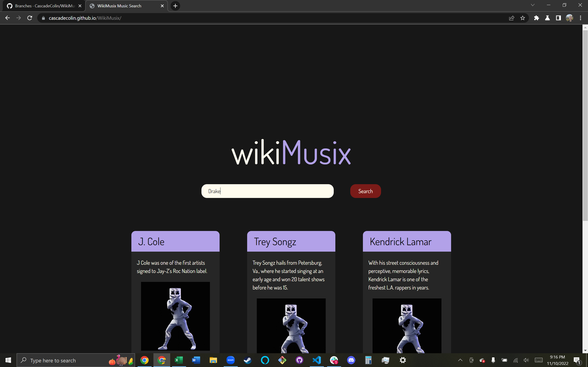

# 07 Project One: WikiMusix

## Table of Contents

- [Description](#Description)
- [Technology](#Technology)
- [License](#license)
- [Badges](#badges)

## Description

Link to our deployed website: https://cascadecolin.github.io/WikiMusix/

**IMPORTANT**:  Due to limitations of Giphy's free API we can only run search results 8 times per hour.  We are rate limited by the free beta API key and our website's design burns through 5 API calls per search.

### Project Details and Functionality

The purpose of WikiMusix is to provide a fun way for people to expand their musical knowledge.  A user can search for their favorite artist and be displayed with five artists that are similar to that one.  Furthermore, each artist comes with a meme that users can enjoy.  Searches are saved and can be recalled at any time by clicking on the search input element and selecting from the dropdown list.

### APIs:  The How and Why

WikiMusix utilizes APIs provided by Napster and Giphy.  Napster is where we obtain the information about similar artists.  Giphy is a file hosting website for animated GIFs. These APIs were chosen mostly by process of elimination.  Our team had a different vision for WikiMusix prior to discovering that the APIs we planned to use were unavailable due to technical limitiations.  We went back to the drawing board and narrowed our focus down to providing a website that allows for the discovery of similar artists to the one searched, as well as spicing things up by providing a meme for each artist.  

We originally were going to use MusixMatch's API to perform the same function that is now performed with Napster's API.  Fun fact:  that is where the inspiration for the name WikiMusix originated!  We also planned to incorporate a series of checkboxes with labels such as "concerts" and "merch".  The intent was to utilize Google Custom Search to let users search for an artist's concerts, merch, etc via Google.  However, due to Google's monetization model and having no way to restrict the API key without risking it costing us money, we settled on the final product that you see now.  This idea may be resivited at a later time once we have a greater understanding of backend web development.

### Challenges That We Faced

In addition to struggles with APIs, we also had some manpower issues.  One of the members of our team dropped the class one day into the project.  Another has been sick and powering through it the entire week.  This resulted in us having to further limit some of the ideas that we had.  In the end, it was a valuable lesson in fully embracing the "MVP" mentality.  All of us had ideas to go beyond what was required and we could have had things gone differently.  However, as a team we had to remember to stay focused on the acceptance criteria and meet a minimum viable product.

We also had some technical challenges.  The biggest of them being our CSS implementation.  The WikiMusix team decided to utilize Tailwind as our CSS framework.  Tailwind on its own is a fantastic CSS framework.  However, the challenges arose when we tried to merge our custom CSS styling into the same elements that had Tailwind styling applied.  We eventually overcame (almost) all of the bugs, and the one remaining bug was deemed minor enough that we decided to let it go as it had no impact on user experience.

Lastly, we had a hard to solve bug that took us 2 days to figure out.  The only thing we could see in DevTools was that something going into the dynamically generated URL was undefined.  However, we had no indication of where the issue was in JavaScript due to the problem arising from a fetch request.  We had to systematically console log every variable at nearly every step of our fetch requests to find the culprit.  While frustrating, we had a nice moment of celebration when we finally figured out the issue.  We had thought that it was an issue with scope, when the real culprit was the function running before the fetch request was completed.  Five lines of code turning it asynchronous was all it took and we were happy to be done with that bug.

### Screenshot of deployeed application featuring a search for the arist "Drake".
Note:  The GIFs do not properly display in this image.  We disabled the API call to preserve the rate calls we used due to rate limiting.

## Technology

Team coordination and planning was achieved using Github, Slack, and Zoom.  Github was utilized primarily for version control.  However, we also used Github Projects to create a kanban board.  This allowed us to know the overall project's status at any given time, and also update it in real time.  Github Pages was also our method of deploying our completed website.  Music artist data is being sourced courtesy of Napster API.  Memes are being sourced from Giphy API.

We chose to use Tailwind as our CSS framework.  This is a framework that is growing in popularity and is thus going to be useful to know in the future.  Using Tailwind allowed us to quickly style containers and cards on our website so that we could focus on the beefier parts of the project.  We also incorporated the font Dosis from Google Fonts.  This was chosen because it is a nice blend of readability mixed with artistic flair, while also being somewhat minimalist.

## License

MIT License

Copyright (c) 2022 CascadeColin

Permission is hereby granted, free of charge, to any person obtaining a copy
of this software and associated documentation files (the "Software"), to deal in the Software without restriction, including without limitation the rights to use, copy, modify, merge, publish, distribute, sublicense, and/or sell copies of the Software, and to permit persons to whom the Software is furnished to do so, subject to the following conditions:

The above copyright notice and this permission notice shall be included in all copies or substantial portions of the Software.

THE SOFTWARE IS PROVIDED "AS IS", WITHOUT WARRANTY OF ANY KIND, EXPRESS OR IMPLIED, INCLUDING BUT NOT LIMITED TO THE WARRANTIES OF MERCHANTABILITY, FITNESS FOR A PARTICULAR PURPOSE AND NONINFRINGEMENT. IN NO EVENT SHALL THE AUTHORS OR COPYRIGHT HOLDERS BE LIABLE FOR ANY CLAIM, DAMAGES OR OTHER LIABILITY, WHETHER IN AN ACTION OF CONTRACT, TORT OR OTHERWISE, ARISING FROM, OUT OF OR IN CONNECTION WITH THE SOFTWARE OR THE USE OR OTHER DEALINGS IN THE SOFTWARE.

## Badges

 

 

